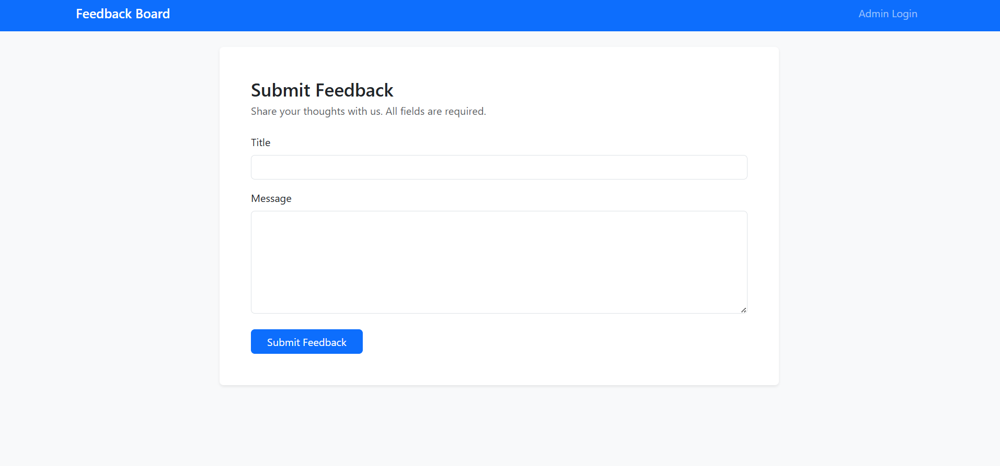
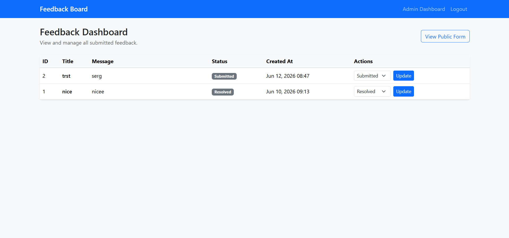

# Feedback Board System

A simple, production-ready Laravel application that lets users submit feedback through a public form and allows administrators to review and update feedback statuses from a protected dashboard.

## Project Overview

This project implements a **Feedback Board System** with two main parts:

1. **Public Feedback Form** — Anyone can submit feedback with a title and message.
2. **Admin Dashboard** — Authenticated admins can view all feedback entries and change their status.

Each feedback record has a status that progresses through:

- `submitted` (default)
- `in_review`
- `resolved`

## Requirements

- PHP 8.3+
- Composer
- MySQL
- Node.js & npm (for Laravel Breeze assets)

## Installation

Clone the repository and run the following commands:

```bash
composer install
```

```bash
cp .env.example .env
```

```bash
php artisan key:generate
```

Configure your database in `.env` (see [Database Configuration](#database-configuration) below).

```bash
php artisan migrate
```

Optionally seed a default admin user:

```bash
php artisan db:seed --class=AdminUserSeeder
```

```bash
php artisan serve
```

Visit `http://localhost:8000` in your browser.

## Database Configuration

Update your `.env` file to use MySQL:

```env
DB_CONNECTION=mysql
DB_HOST=127.0.0.1
DB_PORT=3306
DB_DATABASE=feedback_board
DB_USERNAME=root
DB_PASSWORD=
```

Create the database before running migrations:

```sql
CREATE DATABASE feedback_board;
```

## Authentication (Admin)

Laravel Breeze is installed to protect all `/admin/*` routes with authentication middleware.

### Default Admin Credentials (after seeding)


| Field    | Value              |
|----------|--------------------|
| Email    | admin@example.com  |
| Password | password           |

### Admin Access Steps

1. Run `php artisan db:seed --class=AdminUserSeeder` to create the admin account.
2. Visit `/login` and sign in with the credentials above.
3. Navigate to `/admin/feedbacks` to manage feedback.

You can also register a new account at `/register` and use it to access the admin dashboard.

## Routes

| Method | URI                                  | Description              | Auth Required |
|--------|--------------------------------------|--------------------------|---------------|
| GET    | `/`                                  | Public feedback form     | No            |
| POST   | `/feedbacks`                         | Store new feedback       | No            |
| GET    | `/admin/feedbacks`                   | List all feedbacks       | Yes           |
| PATCH  | `/admin/feedbacks/{feedback}/status` | Update feedback status | Yes           |

## Screenshots

### Public Feedback Form

<!-- Add screenshot: public feedback form -->


### Admin Dashboard

<!-- Add screenshot: admin dashboard -->


## Technical Decisions

### Why Enum Was Used

The `FeedbackStatus` PHP backed enum (`app/Enums/FeedbackStatus.php`) provides type-safe status values across the application. Combined with Eloquent enum casting on the `Feedback` model, this prevents invalid status values at the PHP layer and makes status handling explicit in controllers, views, and validation rules.

### Why Form Requests Were Used

`StoreFeedbackRequest` and `UpdateFeedbackStatusRequest` centralize validation logic away from controllers. This keeps controllers thin, makes validation rules reusable and testable, and follows Laravel conventions for separating HTTP input concerns from business logic.

### Project Structure

```
app/
├── Enums/
│   └── FeedbackStatus.php          # Backed enum for feedback statuses
├── Http/
│   ├── Controllers/
│   │   ├── FeedbackController.php  # Public form (create, store)
│   │   └── Admin/
│   │       └── AdminFeedbackController.php  # Admin list & status update
│   └── Requests/
│       ├── StoreFeedbackRequest.php
│       └── UpdateFeedbackStatusRequest.php
├── Models/
│   └── Feedback.php                # Eloquent model with enum cast
database/
├── migrations/
│   └── 2026_06_10_000000_create_feedbacks_table.php
└── seeders/
    └── AdminUserSeeder.php
resources/views/
├── feedback/
│   └── create.blade.php            # Public feedback form
├── admin/feedbacks/
│   └── index.blade.php             # Admin dashboard table
└── layouts/
    └── bootstrap.blade.php         # Shared Bootstrap 5 layout
routes/
└── web.php                         # Application routes
```

## Tech Stack

- Laravel 12+
- PHP 8.3+
- MySQL
- Blade Templates
- Bootstrap 5 (CDN)
- Eloquent ORM
- Laravel Form Requests
- Laravel Enum Casting
- Laravel Breeze (authentication)

## License

This project is open-sourced software licensed under the [MIT license](https://opensource.org/licenses/MIT).
